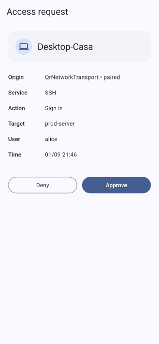
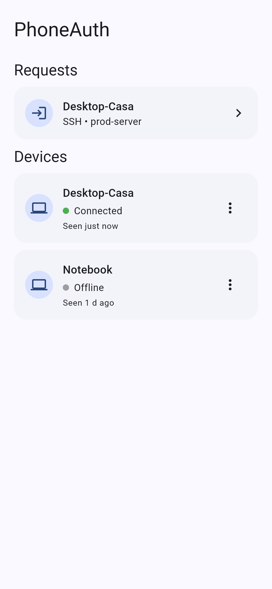
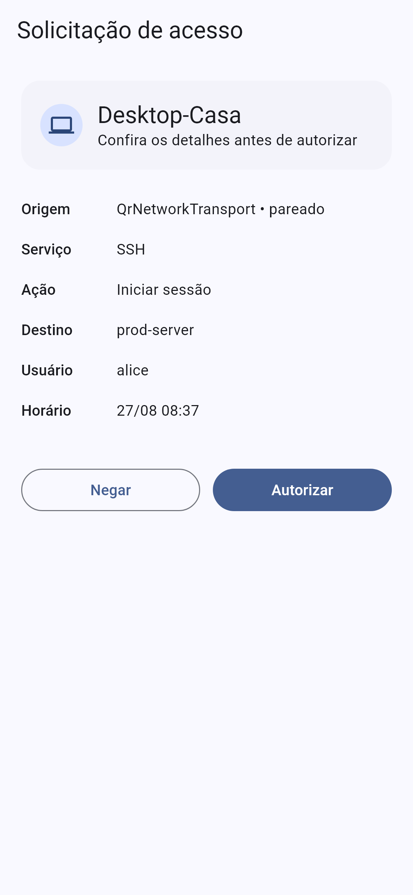
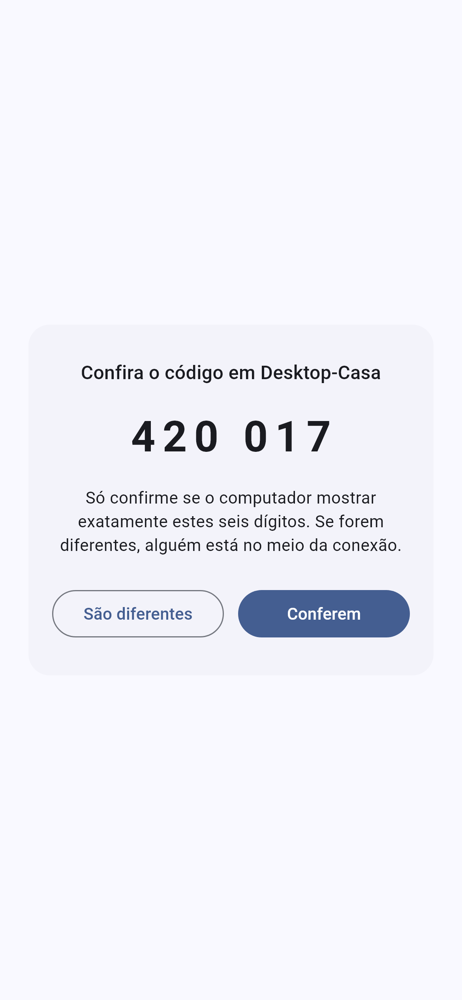
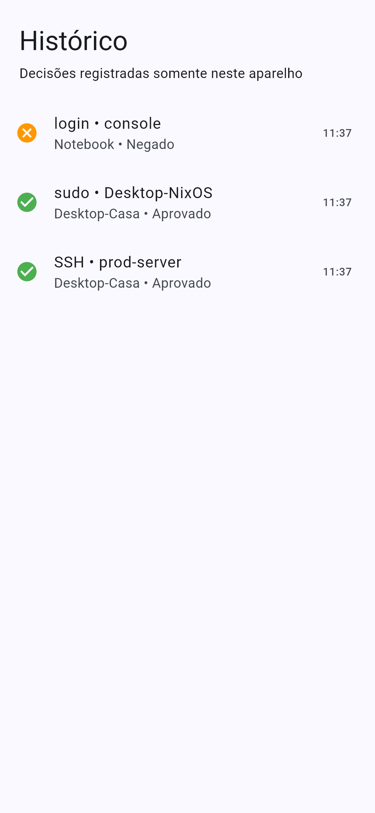

<div align="center">


# PhoneAuth

**Approve your computer's logins with your phone's fingerprint.**
No cloud. No account. No push service. Nothing leaves your network.

[](https://github.com/Gaok1/BioAuth/actions/workflows/ci.yml)
[](https://github.com/Gaok1/BioAuth/releases/latest)
[](#license)



</div>

---

## The idea

Your computer asks for a password because it has no better way to know it is
you. Your phone already does — it has a fingerprint sensor wired to a secure
element, and a key inside it that no software can copy out.

PhoneAuth uses that. When something on your desktop needs authorization — a
login, a `sudo`, unlocking a disk — the request goes to your phone. You see
exactly what is being asked, you touch the sensor, and a key that never leaves
the phone's secure hardware signs the answer.

The desktop only ever verifies. It holds a public key and a policy, and nothing
that could authorize anything on its own.

## Why it is not just a push notification

|                              | Push-based 2FA | PhoneAuth |
|---|---|---|
| Needs internet | yes | no |
| Needs an account | yes | no |
| A vendor can see your logins | yes | there is no vendor |
| What you approve | "someone is logging in" | the exact command, service, user and target |
| What signs the approval | a server, after you tap | a hardware key on your phone, per use |
| Works when the vendor is down | no | there is nothing to be down |

## What it looks like

<table>
<tr>
<td width="25%"></td>
<td width="25%"></td>
<td width="25%"></td>
<td width="25%"></td>
</tr>
<tr>
<td align="center"><b>Paired computers</b><br><sub>and what they are doing</sub></td>
<td align="center"><b>The whole request</b><br><sub>not just "approve?"</sub></td>
<td align="center"><b>Six digits</b><br><sub>compared on both screens</sub></td>
<td align="center"><b>Every decision</b><br><sub>kept on the phone alone</sub></td>
</tr>
</table>

<sub>Screenshots are generated from the running app by
<code>mobile/test/media/capture_screens.dart</code>, not drawn.</sub>

## Install

Grab the files from the [latest release](https://github.com/Gaok1/BioAuth/releases/latest).

| Platform | File | Notes |
|---|---|---|
| **Android 14+** | `PhoneAuth-android.apk` | Needs a fingerprint enrolled and `BIOMETRIC_STRONG` support |
| **Windows 11 x64** | `PhoneAuth-Setup-*.exe` | Installs the tray app and the background agent |
| **Linux x64** | `PhoneAuth-*.AppImage` | Portable, no install |
| **Debian / Ubuntu x64** | `phoneauth_*_amd64.deb` | |
| **Headless Linux x64** | `phone-auth-linux-x86_64.tar.gz` | Agent, CLI and the initrd client |
| **NixOS** | `nix build github:Gaok1/BioAuth#default` | Plus the module at `nixosModules.default` |

Check what you downloaded against `SHA256SUMS.txt` in the same release.

## Pairing

1. Open PhoneAuth on the computer and choose **Pair a phone…**.
2. Scan the code with the phone app.
3. Both screens show six digits. **They must match.**
4. Confirm on both.

The QR code carries a commitment to the desktop's identity key, which is what
lets the phone tell the real computer from anything else answering on that
address — you pointed a camera at that screen, and nothing else vouches for it.

The six digits close the other direction. Someone who photographs the code and
races to pair their own device produces a different handshake, so their digits
differ from the ones on your computer's screen. Skipping that comparison is the
one way to get this wrong.

## How it works

```text
   desktop (verifier)                              phone (authenticator)
         │  QR: session id, nonce, SHA-256(identity key)      │
         │ ────────────────  out of band  ──────────────────▶ │
         │                                                    │
         │  ServerHello — signed, carries the identity key    │
         │  ────────────────────────────────────────────────▶ │ checks the
         │                                                    │ hash from
         │  ClientHello — signed, echoes the server's part     │ the QR
         │ ◀──────────────────────────────────────────────────│
         │                                                    │
      X25519 ─▶ HKDF salted with the transcript ─▶ keys + exporter
         │                                                    │
         │  AuthRequest, inside ChaCha20-Poly1305             │
         │  ────────────────────────────────────────────────▶ │ shows it,
         │                                                    │ fingerprint,
         │  AuthResponse — ECDSA P-256 over the whole request │ signs
         │ ◀──────────────────────────────────────────────────│
```

Four properties do the work:

- **The signature covers the whole request.** Not a challenge — the service,
  the action, the target, the user and the timing. An approval collected for
  one thing cannot be replayed as another.
- **A session binding goes inside the signed request.** Thirty-two bytes both
  ends derive from a secret that never went on the wire, so a captured response
  cannot be moved into a different session.
- **Two separate keys on the phone.** Opening a channel happens whenever the
  phone comes into range, with no user present, and must never touch the key
  that approves a login. That one requires `BIOMETRIC_STRONG`, per use.
- **Forward secrecy.** Identity keys sign; they never encrypt. Recording a
  session and later stealing an identity key does not decrypt the recording.

The wire format is specified in [`docs/protocol-handshake.md`](docs/protocol-handshake.md),
down to the byte, with test vectors both implementations assert independently.

## Status

Honest about what is finished:

| | State |
|---|---|
| Protocol, key schedule, record layer | **Done.** Pinned by shared vectors on both sides |
| QR / local-network transport | **Done.** Phone and desktop, end-to-end over a real socket |
| Pairing, enrolment, verification code | **Done** |
| Android biometric signing | **Implemented.** Keystore, `BIOMETRIC_STRONG`, auth-per-use |
| Android passkeys | Credential Provider, desktop relay, account selection and biometric management implemented; physical/browser matrix pending |
| Bluetooth LE transport | Android LAN→BLE fallback and Linux/BlueZ GATT server implemented; physical-device validation pending |
| Disk unlock from the initrd | Scaffold. Not wired to a real LUKS flow yet |
| iOS | Deferred; outside the first supported matrix |

The end-to-end path has been exercised against a desktop written from the same
specification, over a real TCP socket. It has **not** yet been run phone-to-Rust
on physical hardware — the one seam that leaves untested is the P-256/SPKI
signature exchange between the Android Keystore and the Rust verifier.

## Repository

```text
mobile/                        Flutter app: protocol, transports, screens
packages/phone_auth_native/    Android Keystore and BLE bridge
desktop/crates/                Rust: protocol, session, verifier, agent, CLI
desktop/ui/                    Electron tray
docs/                          Architecture, threat model, wire format
```

## Building from source

```bash
# Phone
cd mobile
flutter pub get
flutter analyze && flutter test
flutter build apk --release --flavor prod --target lib/main_prod.dart

# Desktop
cd desktop
cargo fmt --all -- --check
cargo clippy --workspace --all-targets -- -D warnings
cargo test --workspace

# The same three checks on Linux, which is what CI runs. Needs Docker.
# Off Linux the commands above cannot see `#[cfg(unix)]` code at all, so a
# green run there is not evidence that CI will be green.
tools/linux-check.sh

# Installers
cd desktop && cargo build --release -p phone-auth-agent -p phone-auth-cli
cd ui && npm ci && npx electron-builder --win     # or --linux
```

Local release builds are signed only when real signing material is supplied;
otherwise they remain unsigned. The release workflow refuses to publish until
all four Android signing secrets are configured. A debug APK can only be built
by a non-publishing manual workflow run and is named `PhoneAuth-android-debug`.

## Documentation

- [Wire format and test vectors](docs/protocol-handshake.md)
- [Vault and File Locker application frames](docs/protocol-application.md)
- [Architecture](docs/architecture.md)
- [Threat model](docs/threat-model.md)
- [Product and security decisions](docs/product-decisions.md)
- [Security and vulnerability disclosure](SECURITY.md)
- [Privacy policy](PRIVACY.md)
- [Dependency policy and upgrade procedure](docs/dependencies.md)
- [Desktop internals](docs/desktop.md)
- [Roadmap](docs/roadmap.md)
- [Complete requirements and implementation tracker](docs/implementation-tracker.md)

## License

MIT.
